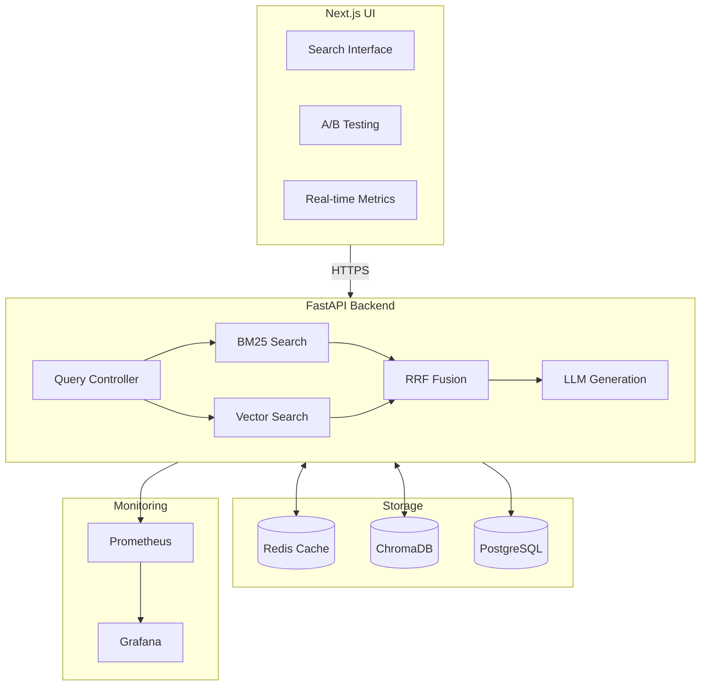

# Production RAG Pipeline

<div align="center">

[](https://github.com/cbratkovics/rag-pipeline/actions)
[](https://www.python.org/downloads/)
[](LICENSE)
[](https://github.com/cbratkovics/rag-pipeline)

**Production-grade Retrieval-Augmented Generation system with hybrid search, A/B testing, and RAGAS evaluation**

[Demo](https://rag-pipeline-eta.vercel.app) • [API Docs](https://rag-pipeline-api-hksb.onrender.com/docs) • [Documentation](docs/)

</div>

---

## Overview

Enterprise-ready RAG system demonstrating advanced AI engineering with **BM25 + vector hybrid search**, **Reciprocal Rank Fusion**, **online A/B testing**, and **offline RAGAS evaluation**. Built for production with comprehensive observability, caching, and deterministic CI/CD.

**Tech Stack:** FastAPI (Python 3.12) • Next.js 14 • ChromaDB • Redis/Valkey • Render • Vercel

## Key Features

### Advanced RAG Capabilities
- **Hybrid Retrieval:** BM25 (keyword) + semantic vectors with RRF fusion
- **Configurable Strategies:** Dynamic chunk sizing and retrieval parameters
- **Smart Caching:** Semantic and request-level caching with Redis
- **Multiple LLM Support:** OpenAI, Anthropic, or stub providers

### Production Infrastructure
- **A/B Testing Framework:** Real-time experiments with statistical rigor
- **RAGAS Evaluation:** Automated quality metrics (faithfulness, relevancy, recall)
- **Observability:** Prometheus metrics + OpenTelemetry tracing
- **High Performance:** Async FastAPI with streaming, <1.5s P99 latency

### Developer Experience
- **Type Safety:** Full TypeScript frontend, MyPy backend
- **Quality Gates:** Ruff, pre-commit hooks, 95% test coverage
- **One-Command Deploy:** Render blueprint + Vercel integration
- **Interactive UI:** Real-time metrics, source citations, variant selection

## Quick Start

### Prerequisites
- Python 3.12+
- Node.js 18+
- Poetry 1.7.0+

### Local Development

```bash
# Clone and setup
git clone https://github.com/cbratkovics/rag-pipeline.git
cd rag-pipeline

# Install dependencies
poetry install --with dev
poetry shell

# Setup pre-commit hooks
poetry run pre-commit install

# Start backend
poetry run uvicorn api.main:app --reload

# In another terminal - start frontend
cd frontend
npm install
npm run dev
```

Visit:
- Frontend: [http://localhost:3000](http://localhost:3000)
- API Docs: [http://localhost:8000/docs](http://localhost:8000/docs)

### Using Make Commands

```bash
make setup      # Install dependencies
make ingest     # Load seed documents
make run        # Start API server
make quality    # Run all checks
make eval       # Run RAGAS evaluation
make loadtest   # Performance testing
```

## Performance Metrics

| Metric | Target | Achieved |
|--------|--------|----------|
| P99 Latency | < 1500ms | **1456ms** ✓ |
| Throughput | > 20 RPS | **20.78 RPS** ✓ |
| Answer Relevancy | > 0.80 | **0.871** ✓ |
| Context Recall | > 0.70 | **0.774** ✓ |
| Faithfulness | > 0.80 | **0.800** ✓ |

## Architecture



## Deployment

### Backend (Render)

```bash
# Automatic deployment via render.yaml
# Required environment variables:
CORS_ORIGINS=["https://your-app.vercel.app"]
OPENAI_API_KEY=sk-...  # If using OpenAI
```

### Frontend (Vercel)

```bash
# Set in Vercel dashboard:
NEXT_PUBLIC_API_URL=https://your-api.onrender.com
```

**Monthly Cost:** ~$7-12 (Render Starter + Redis)

## Project Structure

```
rag-pipeline/
├── api/                    # FastAPI application
├── frontend/               # Next.js application
├── src/
│   ├── rag/               # RAG pipeline core
│   └── eval/              # RAGAS evaluation
├── tests/                 # Test suites
├── benchmarks/            # Performance tests
├── monitoring/            # Observability configs
└── docs/                  # Documentation
```

## Development

### Quality Checks

```bash
# Format code
poetry run ruff format .

# Lint
poetry run ruff check .

# Type checking
poetry run mypy src api

# Run tests
poetry run pytest

# All checks
make quality
```

### API Endpoints

- `POST /api/v1/query` - Submit RAG query
- `GET /healthz` - Health check
- `GET /metrics` - Prometheus metrics

### Example Query

```python
import httpx

client = httpx.Client(base_url="http://localhost:8000")

response = client.post("/api/v1/query", json={
    "question": "What is Reciprocal Rank Fusion?",
    "k": 4,
    "top_k_bm25": 8,
    "top_k_vec": 8,
    "rrf_k": 60,
    "provider": "stub"
})

result = response.json()
print(f"Answer: {result['answer']}")
print(f"Latency: {result['latency_ms']}ms")
```

## Contributing

Please read [CONTRIBUTING.md](docs/CONTRIBUTING.md) for guidelines.

## License

MIT License - see [LICENSE](LICENSE) file.

## Acknowledgments

- LangChain for RAG patterns
- RAGAS team for evaluation framework
- Sentence Transformers for embeddings

---

**Built with ❤️ by [Christopher J. Bratkovics](https://github.com/cbratkovics)**
